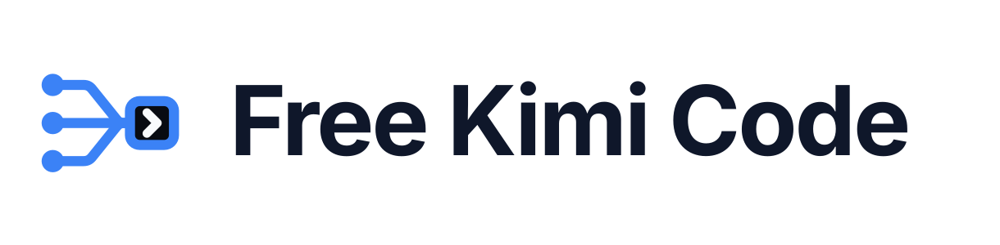

<div align="center">

<picture>
  <source media="(prefers-color-scheme: dark)" srcset="assets/free-kimi-code-dark.svg">
  
</picture>

<br>
<br>

**A calm, capable developer layer for Kimi Code.**

Live models · portable skills · safe artifacts · provider routing · a cleaner terminal —
*without replacing the Kimi Code experience.*

<br>

[](https://github.com/BlizPS/lazy-developer-free-kimi-code)
[](LICENSE)
[](#-installation)
[](https://github.com/BlizPS/lazy-developer-free-kimi-code/stargazers)

<p>
  <a href="#-installation">Installation</a> ·
  <a href="#-highlights">Highlights</a> ·
  <a href="#-skills">Skills</a> ·
  <a href="#-commands">Commands</a> ·
  <a href="https://github.com/BlizPS/lazy-developer-free-kimi-code/issues">Issues</a> ·
  <a href="https://github.com/BlizPS/lazy-developer-free-kimi-code/discussions">Discussions</a>
</p>

</div>

---

## 💡 What is Lazy Developer?

**Lazy Developer** is a free, open-source developer layer for the **Kimi Code CLI**. It keeps Kimi Code's normal workflow intact while adding portable skills, model routing, safer artifacts, web-search fallback, and a quieter terminal.

```text
Lazy Developer
 ├── Kimi Code CLI
 ├── 4 portable skills
 ├── token-efficient responses
 ├── provider + model routing
 ├── safe artifact handling
 ├── web-search fallback
 └── RTK terminal cleanup
```

## 🚀 Quick Start

```bash
# 1. Install (macOS / Linux)
curl -fsSL "https://raw.githubusercontent.com/BlizPS/lazy-developer-free-kimi-code/main/install.sh" | sh

# 2. Pick your model route
lazydev setup

# 3. Start coding
lazydev chat
```

> [!TIP]
> On Windows? Jump to the [PowerShell installer](#-installation).

---

## ✨ Highlights

| | Feature | What it gives you |
|---|---|---|
| 🧠 | **4 focused skills** | Implementation, debugging, review, and testing — portable across compatible agent CLIs |
| 🪶 | **Response economy** | Runtime layer targeting ~75% less avoidable prose |
| ⚡ | **RTK integration** | Noisy terminal output trimmed before it reaches the model |
| 🔌 | **Live model routing** | `lazydev setup` discovers available models and configures your route |
| 🔐 | **Native Kimi auth** | `/login` and `/logout` stay native to Kimi Code |
| 🧩 | **Session compatibility** | Compatibility aliases for older LazyDev model names |
| 📁 | **Safe artifacts** | Never overwrites an existing file |
| 🌐 | **Search fallback** | Bundled `lazydev-search` MCP service when host search is unavailable |

<details>
<summary><b>🪶 Real response economy</b></summary>

<br>

Lazy Developer includes an active runtime response-economy layer targeting **~75% less avoidable prose**. It is applied across the supported CLI/plugin paths, not just written as a suggestion inside a skill.

The goal is simple: keep the code, commands, decisions, and useful evidence — cut the filler.

</details>

<details>
<summary><b>⚡ RTK integration</b></summary>

<br>

**Rust Token Killer (RTK)** trims noisy terminal output before it reaches the model, reducing one of the more pointless ways an agent can burn context.

</details>

<details>
<summary><b>🔌 Live model routing &nbsp;·&nbsp; 🔐 Native Kimi auth &nbsp;·&nbsp; 🧩 Session compatibility</b></summary>

<br>

- `lazydev setup` discovers available models and configures the selected route without replacing the native Kimi Code experience.
- `/login` and `/logout` stay native to Kimi Code. Lazy Developer keeps inference routing separate, so authentication never silently replaces your selected model.
- Model changes can use compatibility aliases for older LazyDev model names, without rewriting the saved conversation history.

</details>

<details>
<summary><b>📁 Safe artifacts</b></summary>

<br>

Standalone files use the canonical `lazydevfile` directory and **never overwrite** an existing artifact. When a filename already exists, Lazy Developer uses the lowest free numeric suffix:

```text
report.html
report1.html
report2.html
```

</details>

<details>
<summary><b>🌐 Search fallback</b></summary>

<br>

When the host search service is unavailable, the bundled `lazydev-search` MCP service can provide web search without forcing a provider switch.

</details>

---

## 🧠 Skills

Four focused skills that work through the normal skills system, so they can travel with compatible agent CLIs instead of being glued to Lazy Developer itself.

| Skill | Purpose |
|---|---|
| `lazy-developer` | Implementation, architecture, UI/UX, and engineering workflow |
| `lazy-debug` | Cause → fix → proof |
| `lazy-review` | Actionable findings without the usual essay |
| `lazy-test` | Focused testing and verification |

---

## 📦 Installation

### Lazy Developer CLI

<table>
<tr>
<td><b>🍎 macOS / 🐧 Linux</b></td>
<td>

```bash
curl -fsSL "https://raw.githubusercontent.com/BlizPS/lazy-developer-free-kimi-code/main/install.sh" | sh
```

</td>
</tr>
<tr>
<td><b>🪟 Windows PowerShell</b></td>
<td>

```powershell
& ([scriptblock]::Create((irm "https://raw.githubusercontent.com/BlizPS/lazy-developer-free-kimi-code/main/install.ps1")))
```

</td>
</tr>
</table>

After installation:

```bash
lazydev setup
lazydev chat
```

### Universal Skills CLI

The bundled skills can also be installed independently for compatible agent CLIs:

```bash
npx skills add BlizPS/lazy-developer-free-kimi-code --all
```

> [!NOTE]
> This installs the same bundled skills without requiring the `lazydev` CLI.

<details>
<summary><b>🐢 Termux / Android</b></summary>

<br>

Kimi Code's Linux binary needs a glibc-based Linux userland. On Termux, use a Debian or Ubuntu guest:

```bash
pkg update
pkg install proot-distro
proot-distro install debian
proot-distro login debian
```

Then run the normal Lazy Developer installer inside the guest:

```bash
curl -fsSL "https://raw.githubusercontent.com/BlizPS/lazy-developer-free-kimi-code/main/install.sh" | sh
```

</details>

---

## 🔄 Updating

Run the installer again to refresh the current installation.

**macOS / Linux**

```bash
curl -fsSL "https://raw.githubusercontent.com/BlizPS/lazy-developer-free-kimi-code/main/install.sh" | sh
```

**Windows PowerShell**

```powershell
& ([scriptblock]::Create((irm "https://raw.githubusercontent.com/BlizPS/lazy-developer-free-kimi-code/main/install.ps1")))
```

Then verify the installed version:

```bash
lazydev version
```

## 🗑️ Uninstalling

**macOS / Linux**

```bash
curl -fsSL "https://raw.githubusercontent.com/BlizPS/lazy-developer-free-kimi-code/main/uninstall.sh" | sh
```

**Windows PowerShell**

```powershell
& ([scriptblock]::Create((irm "https://raw.githubusercontent.com/BlizPS/lazy-developer-free-kimi-code/main/uninstall.ps1")))
```

> [!NOTE]
> Uninstalling the Lazy Developer CLI does not remove skills installed separately through a compatible skills manager.

---

## 🧰 Commands

| Command | Description |
|---|---|
| `lazydev help` | Show available commands |
| `lazydev setup` | Discover models and configure your route |
| `lazydev chat` | Start a chat session |
| `lazydev sessions` | Manage saved sessions |
| `lazydev skills` | Manage bundled skills |
| `lazydev artifact <filename>` | Create a safe, non-overwriting artifact |
| `lazydev env` | Show environment details |
| `lazydev doctor` | Diagnose your installation |
| `lazydev version` | Print the installed version |

---

## 🛡️ Safe by Default

- ✅ Standalone artifacts never overwrite existing files.
- ✅ Saved sessions stay in place during normal model switching.
- ✅ Strict proxy routes can repair incomplete tool-call history.

> [!WARNING]
> Never commit API keys, OAuth tokens, or provider credentials.

---

## 🤝 Community

Found a bug or have an idea? We'd love to hear it.

- 🐛 [Open an issue](https://github.com/BlizPS/lazy-developer-free-kimi-code/issues)
- 💬 [Join the discussions](https://github.com/BlizPS/lazy-developer-free-kimi-code/discussions)
- ⭐ Like the project? A star helps others find it.

## 📄 License

Released under the **MIT License** — see [LICENSE](LICENSE).

---

<div align="center">
  <sub>Built by <strong>BlizPS</strong> · Lazy Developer 1.0.0</sub>
</div>
